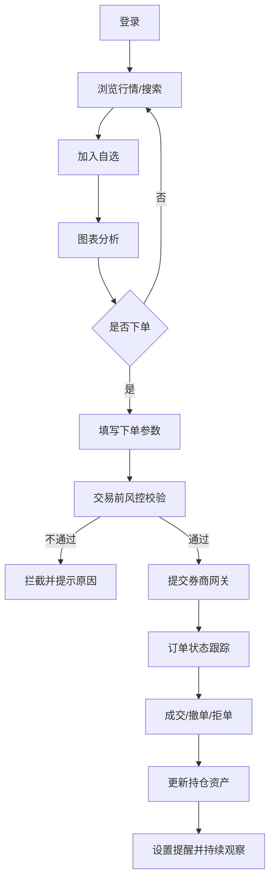
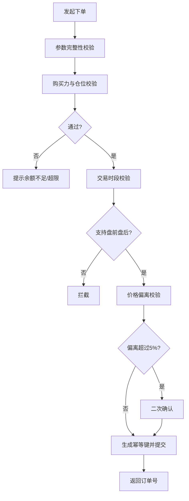

# 股票交易系统 MVP 详细需求说明（0~6个月）

> 本文档为 `functional-requirements.md` 中 5.1 MVP 章节的落地细化版本，面向产品、设计、研发、测试协作。

## 1. 文档目标与适用范围

- 目标：将 MVP 从“能力清单”细化为“可开发、可测试、可验收”的执行规格。
- 适用角色：产品经理、交互设计、前后端研发、测试、风控运营。
- 终端范围：Web（桌面优先），移动端仅支持只读行情。
- 市场范围：美股、港股 Level1（行情与交易）。
- 券商范围：首批 1~2 家（建议 IBKR + 富途）。
- 模拟范围：默认提供 1 个模拟账户（Paper Account），支持全链路模拟交易与复盘。

---

## 2. MVP 功能域拆解（WBS）

### 2.1 功能清单总览

| 域 | 功能ID | 功能点 | 优先级 |
|---|---|---|---|
| 账户与安全 | MVP-ACC-01 | 注册/登录（邮箱、手机号） | P0 |
| 账户与安全 | MVP-ACC-02 | 新设备验证、登录风控 | P0 |
| 行情与自选 | MVP-MKT-01 | 行情列表、搜索、个股详情 | P0 |
| 行情与自选 | MVP-MKT-02 | 自选分组、批量管理 | P0 |
| 图表分析 | MVP-CHT-01 | K线周期切换与基础指标 | P0 |
| 图表分析 | MVP-CHT-02 | 绘图工具与模板保存 | P1 |
| 交易与订单 | MVP-TRD-01 | 市价/限价下单 | P0 |
| 交易与订单 | MVP-TRD-02 | 撤单、订单状态跟踪 | P0 |
| 资产与持仓 | MVP-AST-01 | 资产总览、持仓明细 | P0 |
| 资产与持仓 | MVP-AST-02 | 多账户筛选/聚合 | P1 |
| 提醒与通知 | MVP-ALT-01 | 价格提醒创建/管理 | P0 |
| 提醒与通知 | MVP-ALT-02 | 站内信/邮件触达 | P0 |
| 模拟交易 | MVP-SIM-01 | 模拟账户与初始资金 | P0 |
| 模拟交易 | MVP-SIM-02 | 模拟下单、成交、持仓与资产同步 | P0 |

### 2.2 域内详细拆解

#### A. 账户与安全（MVP-ACC）

**A-1 注册登录（MVP-ACC-01）**
- 输入项：账号、密码、验证码。
- 输出项：登录态 token、用户 profile、权限集。
- 规则：
  - 密码长度 8~32，必须包含大小写与数字。
  - 验证码 5 分钟有效，最多尝试 5 次。

**A-2 登录风控（MVP-ACC-02）**
- 触发条件：新设备、异地 IP、短时频繁失败。
- 风控动作：二次验证码、人机校验、临时锁定。
- 审计字段：用户ID、设备指纹、IP、时间戳、触发规则ID。

**交互流程定义**
1. 用户提交登录信息。
2. 服务端进行账号校验与风控判定。
3. 命中风控时展示二次验证弹层。
4. 验证通过后进入行情首页；失败则提示并记录剩余次数。

**边界场景约束**
- 连续失败 ≥5 次：账号锁定 15 分钟。
- 系统时间漂移 >2 分钟：验证码校验失败并提示同步本地时间。
- 登录成功后 30 天未活跃：需重新验证设备。

---

#### B. 行情与自选（MVP-MKT）

**B-1 行情列表与搜索（MVP-MKT-01）**
- 列表字段：代码、名称、最新价、涨跌幅、成交量、市场标识。
- 搜索能力：代码精确匹配 + 名称前缀匹配。
- 个股页：分时图、最新成交、涨跌区间、买卖一档。

**B-2 自选分组（MVP-MKT-02）**
- 分组上限：每用户 20 组；每组 500 标的。
- 操作：新增分组、重命名、拖拽排序、移入移出。

**交互流程定义**
1. 用户在行情页输入关键词搜索。
2. 点击标的进入个股详情。
3. 点击“加入自选”，选择分组并确认。
4. 自选列表实时刷新并高亮新加入标的。

**边界场景约束**
- 行情授权不足：显式展示“延时行情”标签。
- 标的停牌/退市：禁用新增提醒与下单入口。
- 搜索服务异常：回退到本地热门标的缓存。

---

#### C. 图表分析（MVP-CHT）

**C-1 图表基础（MVP-CHT-01）**
- 周期：1m/5m/15m/1D。
- 指标：MA、EMA、MACD、RSI。
- 数据策略：主图优先、指标异步加载。

**C-2 绘图与模板（MVP-CHT-02）**
- 工具：趋势线、水平线、文本标注。
- 模板：最多保存 3 套；支持覆盖与重命名。

**交互流程定义**
1. 在个股页切换至 K 线标签。
2. 设置周期，添加指标，绘制标注。
3. 点击“保存模板”并命名。
4. 切换标的后应用模板。

**边界场景约束**
- 单图指标上限 4 个，超限提示升级 Pro。
- 弱网下图表分辨率自动降级。
- 非交易时段停止实时推送，仅保留手动刷新。

---

#### D. 交易与订单（MVP-TRD）

**D-1 下单（MVP-TRD-01）**
- 订单类型：市价、限价。
- 入参：账户、方向、数量、价格（限价必填）、有效期（DAY）。
- 提交前校验：购买力、最小交易单位、时段、风控限额。

**D-2 订单管理（MVP-TRD-02）**
- 状态机：待提交 → 已提交 → 部分成交/已成交/已撤销/拒单。
- 操作：撤单；查询订单详情（含拒单原因、费用预估）。

**交互流程定义**
1. 用户点击“交易”打开下单面板。
2. 选择账户、输入订单参数。
3. 触发前置校验并展示确认弹窗。
4. 提交后返回订单号并进入订单列表。
5. 未成交订单可执行撤单。

**边界场景约束**
- 价格偏离现价 ±5%：二次确认。
- 交易时段外提交：若不支持盘前盘后则直接拦截。
- 网络重试导致重复点击：由幂等键去重。

---

#### E. 资产与持仓（MVP-AST）

**E-1 资产总览（MVP-AST-01）**
- 指标：总资产、现金、持仓市值、当日盈亏、购买力。
- 刷新：默认 10 秒轮询 + 用户手动刷新。

**E-2 持仓明细（MVP-AST-02）**
- 字段：持仓数量、可卖数量、成本价、现价、浮盈亏、收益率。
- 维度：按账户过滤。

**交互流程定义**
1. 进入资产页展示总览卡片。
2. 列表展示各持仓明细与盈亏色彩标识。
3. 点击持仓项跳转个股页执行加减仓。

**边界场景约束**
- 汇率拉取失败：采用最近一次可用汇率并标记“估算”。
- 券商数据延迟：页面显示“同步中”状态与更新时间。

---

#### F. 提醒与通知（MVP-ALT）

**F-1 价格提醒（MVP-ALT-01）**
- 类型：向上突破、向下跌破。
- 限额：每用户最多 30 条生效提醒。
- 去重：同标的+同方向+同阈值仅允许一条。

**F-2 通知触达（MVP-ALT-02）**
- 渠道：站内信（默认）+ 邮件（可选）。
- 内容：标的、触发价、触发时间、触发来源。

**交互流程定义**
1. 在个股页输入提醒阈值并选择方向。
2. 系统校验后创建任务。
3. 触发后推送通知并写入历史记录。
4. 用户可暂停/恢复/删除提醒。

**边界场景约束**
- 行情源中断 >60 秒：暂停触发并发送系统告警。
- 价格瞬时跳变跨越阈值：按“首次穿越”规则只触发一次。

---

#### G. 模拟账户与模拟交易（MVP-SIM）

**G-1 模拟账户（MVP-SIM-01）**
- 默认开通：用户注册后自动创建模拟账户。
- 初始资金：100,000 USD（运营可配置）。
- 账户能力：现金、持仓、订单、成交、盈亏统计与真实账户界面一致。

**G-2 模拟交易（MVP-SIM-02）**
- 支持订单：市价、限价、撤单、订单状态流转。
- 撮合规则：
  - 市价单按当前最新价 + 模拟滑点（默认 0~5bp）成交。
  - 限价单按“可成交即成交”原则，参考盘口或最新价。
- 成交回报：写入模拟成交记录并驱动持仓/资产实时更新。

**交互流程定义**
1. 用户进入交易页选择“模拟账户”。
2. 填写订单参数并执行风控预检。
3. 系统进入模拟撮合引擎生成成交/未成交结果。
4. 订单、持仓、资产、通知中心同步更新。

**边界场景约束**
- 未绑定真实券商时，默认仅展示模拟账户，不影响行情分析与提醒功能。
- 模拟账户与真实账户数据必须强隔离，禁止混算资产与持仓。
- 支持“一键重置模拟账户”，重置后清空模拟订单/成交/持仓并恢复初始资金。

---

## 3. MVP 业务流程图

### 3.1 交易主流程

### 3.2 下单风控子流程

---

## 4. 页面级交互流程定义

## 4.1 行情首页
- 入口：登录成功后默认页。
- 主任务：发现标的、快速进入分析。
- 关键状态：加载中、无数据、延时行情、断线重连。

## 4.2 个股详情页
- 区块：分时/K线、盘口摘要、交易入口、提醒入口。
- 主任务：分析并发起交易。
- 关键状态：停牌、交易关闭、行情延时。

## 4.3 下单/订单页
- 区块：下单面板、当日订单、历史订单。
- 主任务：下单与订单追踪。
- 关键状态：提交中、已拒单、可撤单、撤单失败。

## 4.4 资产持仓页
- 区块：资产卡片、持仓表格、账户筛选。
- 主任务：查看盈亏与仓位风险。
- 关键状态：汇率估算、数据同步中。

## 4.5 提醒通知页
- 区块：生效提醒、触发历史、通知收件箱。
- 主任务：管理提醒与查看触达结果。
- 关键状态：提醒暂停、触发失败、渠道不可达。

---

## 5. 边界与约束总表（测试重点）

| 场景 | 约束 | 预期系统行为 |
|---|---|---|
| 登录连续失败 | 5次/15分钟 | 锁定账号并提示剩余时间 |
| 行情未授权 | 延时数据 | 显示“延时标签”与时间戳 |
| 下单重复点击 | 网络抖动 | 幂等去重，仅创建1笔订单 |
| 停牌标的 | 交易限制 | 禁用下单与新提醒 |
| 汇率获取失败 | 外部依赖异常 | 显示估算资产并打标 |
| 行情源中断 | >60秒 | 暂停提醒触发并系统告警 |
| 未开通真实券商 | 无真实账户 | 默认启用模拟账户并提示可随时切换实盘 |
| 模拟账户重置 | 用户主动重置 | 清空模拟历史并恢复初始资金 |

---

## 6. MVP 验收标准

- 业务闭环：用户可完成“登录→行情→分析→下单→持仓→提醒”。
- 性能：
  - 下单到返回订单号 P95 < 2s。
  - 行情首屏 P95 < 3s。
- 一致性：订单状态与券商日终对账一致率 ≥ 99.5%。
- 可用性：交易时段关键链路可用性 ≥ 99.9%。
- 可体验性：未绑定真实券商用户可完成“行情→分析→模拟下单→查看模拟持仓→设置提醒”全闭环。

